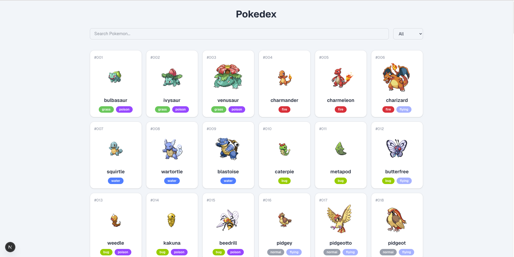
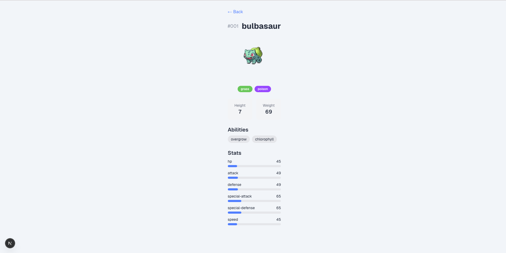
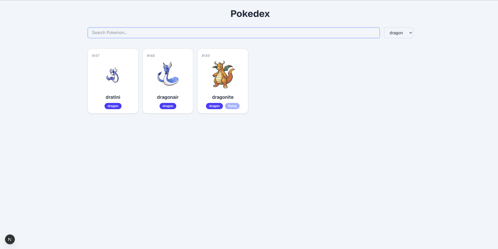
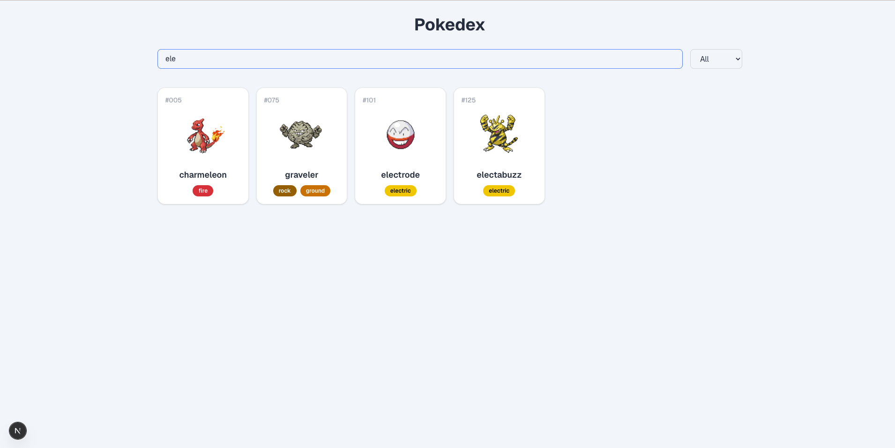

# Pokedex - Pokemon Explorer

A production-ready Pokemon listing and detail application built with Next.js, featuring ISR (Incremental Static Regeneration), client-side filtering, and a strict TDD workflow.

**Live Demo:** [https://pokemon.kalpeshchaudhari.dev/](https://pokemon.kalpeshchaudhari.dev/])

## Screenshots






---

## Setup Instructions

### Prerequisites

- Node.js 18+
- npm 9+

### Installation

```bash
git clone https://github.com/kalpeshchaudharee/pokemon.git
cd pokemon
npm install
```

### Development

```bash
npm run dev
```

Open [http://localhost:3000](http://localhost:3000).

### Testing

```bash
npm run test        # Watch mode
npm run test:run    # Single run
```

### Production Build

```bash
npm run build
npm start
```

---

## Tech Stack


| Layer      | Technology                           |
| ---------- | ------------------------------------ |
| Framework  | Next.js 16 (App Router)              |
| Language   | TypeScript                           |
| Styling    | Tailwind CSS 4                       |
| Testing    | Vitest + React Testing Library + MSW |
| API        | PokeAPI v2                           |
| Deployment | Vercel                               |


---

## Architectural Decisions

### ISR (Incremental Static Regeneration)

- **Listing page (`/`)**: Fetches all 151 Gen 1 Pokemon at build time with `revalidate = 3600`. The page is statically generated and revalidated every hour.
- **Detail page (`/pokemon/[name]`)**: Uses `generateStaticParams` to pre-render all 151 detail pages at build. On-demand pages are generated and cached with the same 1-hour revalidation.
- **Why ISR over SSR/CSR**: PokeAPI data rarely changes. ISR gives static-site speed with automatic freshness — the best trade-off for a stable dataset.

### Client-Side Filtering

Filtering (search + type dropdown) happens entirely client-side on the pre-fetched 151 Pokemon. This means:

- Zero loading spinners when searching or filtering — instant feedback
- No waterfall requests on user interaction
- The full dataset is small enough (~15KB) that shipping it to the client is negligible

### Data Architecture

```
Server Component (page.tsx)
  └── fetchPokemonList() / fetchPokemonDetail()  ← runs at build/revalidation time
        └── fetch() with next: { revalidate: 3600 }  ← cached by Next.js
              └── PokeAPI v2

Client Component (PokemonGrid)
  └── receives pre-fetched data as props
        └── filters in-memory with useMemo
```

### Component Design

- **Server Components** for pages — data fetching at the edge, zero JS shipped for layout
- **Client Components** only where interactivity is needed: `PokemonGrid` (filter state), `SearchFilter` (input state with debounce)
- **Presentational components** (`PokemonCard`, `TypeBadge`, `PokemonDetail`) are pure — easy to test, no side effects

### Project Structure

```
app/
  page.tsx                       → Listing page (Server Component, ISR)
  loading.tsx                    → Listing page skeleton
  error.tsx                      → Global error boundary
  not-found.tsx                  → Global 404
  pokemon/[name]/
    page.tsx                     → Detail page (Server Component, ISR)
    loading.tsx                  → Detail page skeleton
    not-found.tsx                → Pokemon-specific 404
components/
  TypeBadge.tsx + test           → Type color pill
  PokemonCard.tsx + test         → Card with link to detail
  SearchFilter.tsx + test        → Debounced search + type dropdown
  PokemonGrid.tsx + test         → Filterable grid (client component)
  PokemonDetail.tsx + test       → Full pokemon stats view
lib/
  pokeapi.ts + test              → API client with typed responses
types/
  pokemon.ts                     → Shared TypeScript interfaces
test/
  setup.ts                       → Vitest + RTL + MSW configuration
  mocks/                         → MSW handlers and test fixtures
```

---

## Trade-offs


| Decision                                     | Trade-off                                                                                                                                  |
| -------------------------------------------- | ------------------------------------------------------------------------------------------------------------------------------------------ |
| Fetch 151 Pokemon upfront                    | Slower initial build (~30s) but instant runtime filtering. Acceptable because ISR caches the result.                                       |
| Client-side filtering                        | Ships ~15KB of Pokemon data to the client. For 151 items this is fine; for 1000+ would need server-side search.                            |
| `` over `next/image` in some components | Simpler test setup. Using `next/image` with `unoptimized` where possible for compatibility.                                                |
| Debounce on search (300ms)                   | Prevents excessive re-renders during typing. Slight delay in feedback, but avoids layout thrashing on large lists.                         |
| Mocking Server Components in page tests      | Can't render async Server Components directly in RTL. Tested by calling the component as an async function and rendering the returned JSX. |
| No global state management                   | Props and local state are sufficient for this scale. No need for Context, Zustand, or Redux.                                               |


---

## TDD Process

Every feature followed a strict **red → green → refactor** cycle:

1. **RED**: Write a failing test that defines the expected behavior
2. **GREEN**: Write the minimum code to make the test pass
3. **REFACTOR**: Improve code quality without changing behavior

The commit history reflects this pattern:

```
test(api): add failing test for fetchPokemonList          ← RED
feat(api): implement fetchPokemonList with PokeAPI        ← GREEN
refactor(api): extract API response types and fetch helper ← REFACTOR
test(badge): add failing test for TypeBadge rendering     ← RED
feat(badge): implement TypeBadge component                ← GREEN
...
```

### Testing Strategy

- **Unit tests** for data layer (`lib/pokeapi.ts`) — MSW intercepts network calls for realistic API mocking
- **Component tests** for each UI component — React Testing Library with user-centric queries
- **Integration tests** for pages — mocked dependencies, tested data flow from fetch to render
- **All tests are fast and deterministic** — no real network calls, no flaky timeouts

---

## AI Usage

This project was built with AI assistance (Cursor with Claude). Here's how AI was used:


| Area                        | How AI was used                                                                                        |
| --------------------------- | ------------------------------------------------------------------------------------------------------ |
| **Planning**                | Generated the initial project plan including architecture, TDD phases, and commit conventions          |
| **Test scaffolding**        | AI suggested test cases for each component, covering happy paths, edge cases, and error states         |
| **Implementation guidance** | AI provided component implementations following the test specifications                                |
| **Debugging**               | AI helped diagnose test failures (fake timers with userEvent, RTL query conflicts, MSW handler issues) |
| **Configuration**           | Vitest + MSW + RTL setup, Next.js image config, TypeScript path aliases                                |
| **Documentation**           | README structure and content                                                                           |


All code was reviewed, understood, and manually committed. AI served as a pair programming partner — accelerating the TDD cycle while maintaining code quality and ownership of decisions.